# Covid-Relief-Website

- A website that helps people in this tough situation of Covid 19 by providing them the Valid Information about Available Plasma Donors, Hospital Beds, Oxygen Suppiers, Medicine/Injection Suppliers, Ambulance Service Providers and Meal/Tiffin Service Providers.
- Website made using HTML, CSS, JavaScriot and Bootstrap.
- Created with ❤ by Prashant Agheda 😊

# Result of the Project

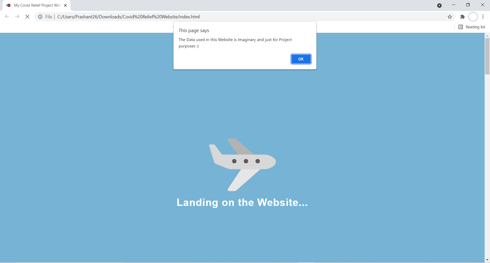

---

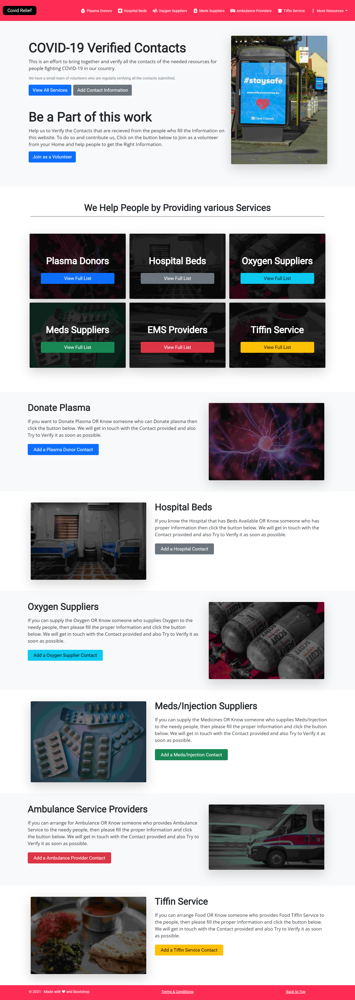

---

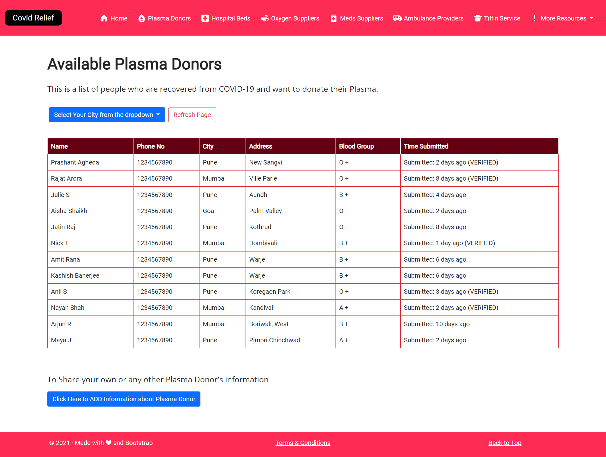

---

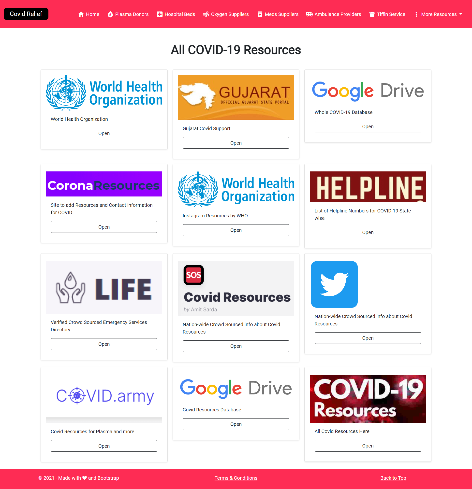

---

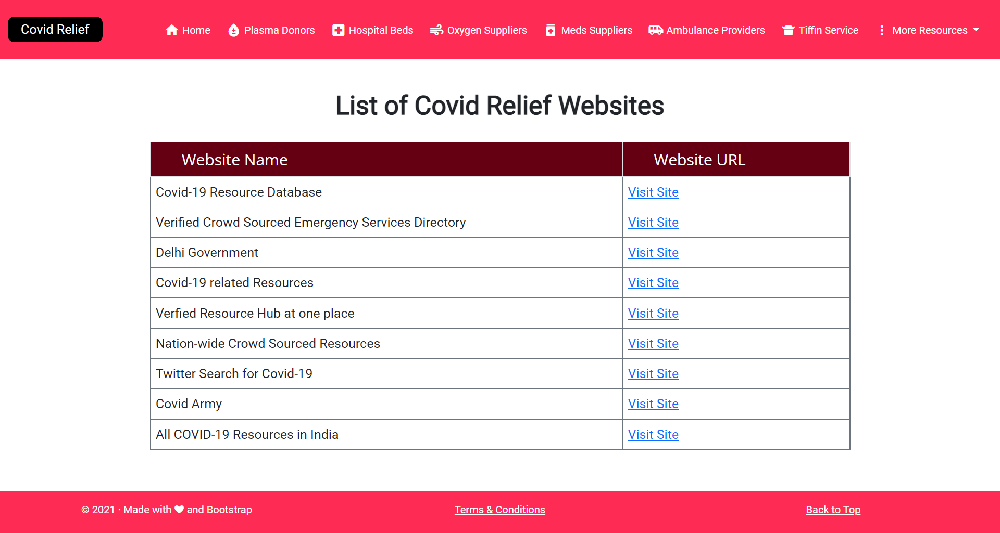

---

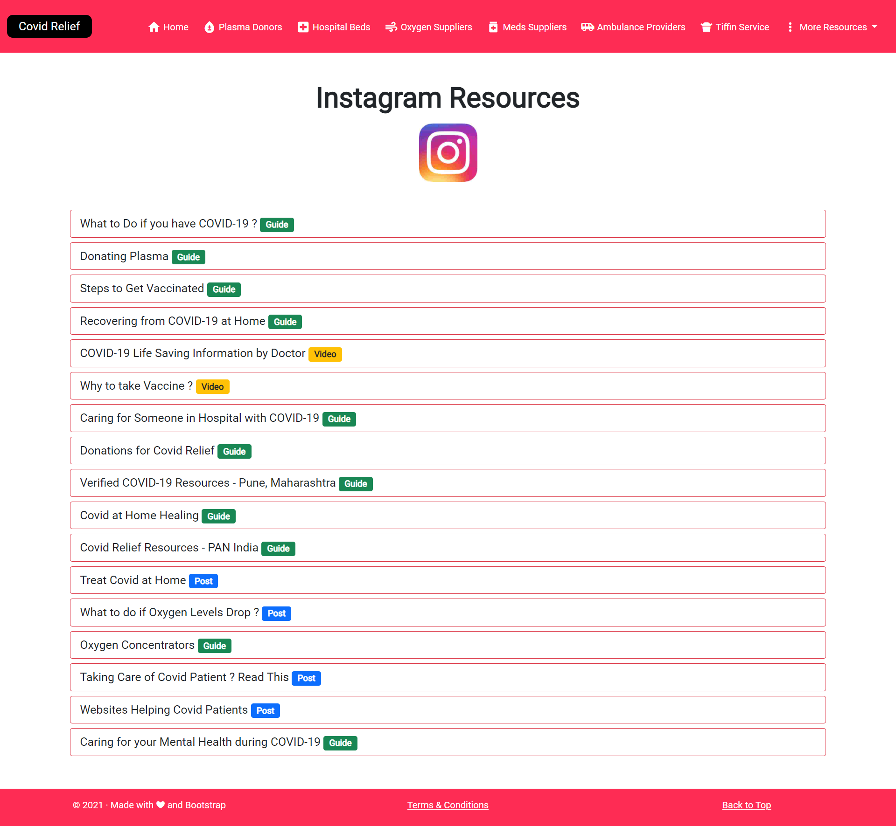

---

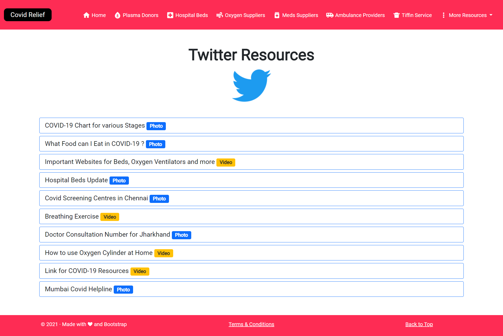

---

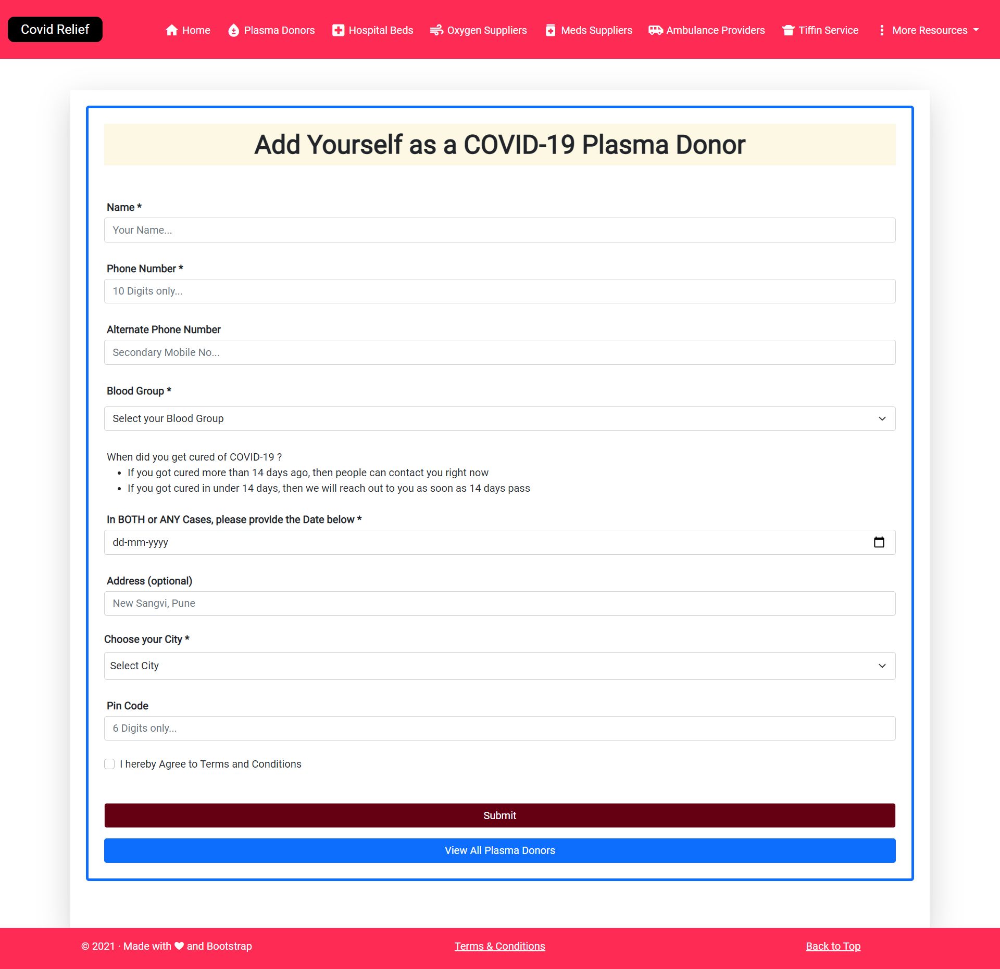

---

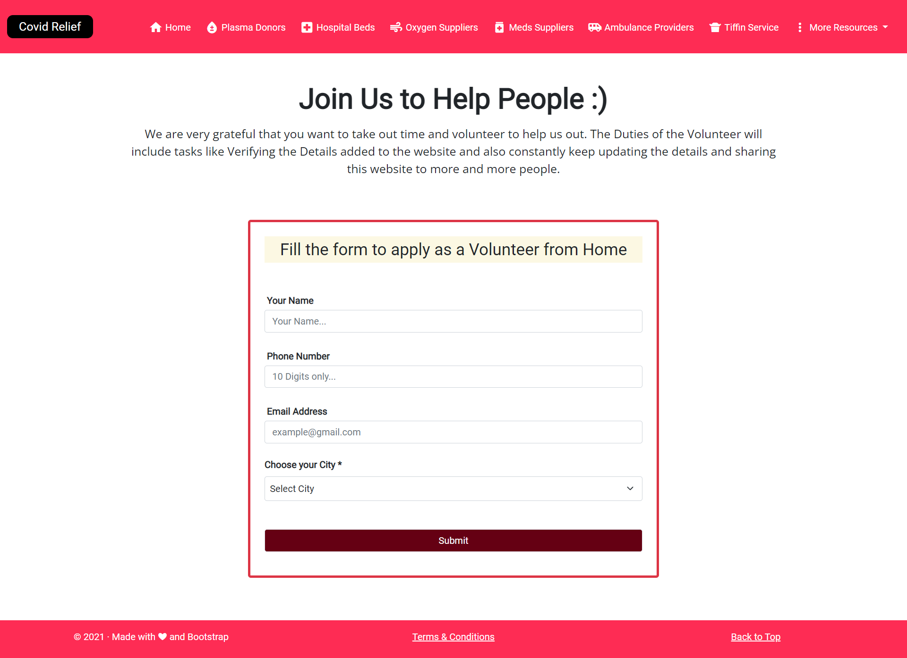

---

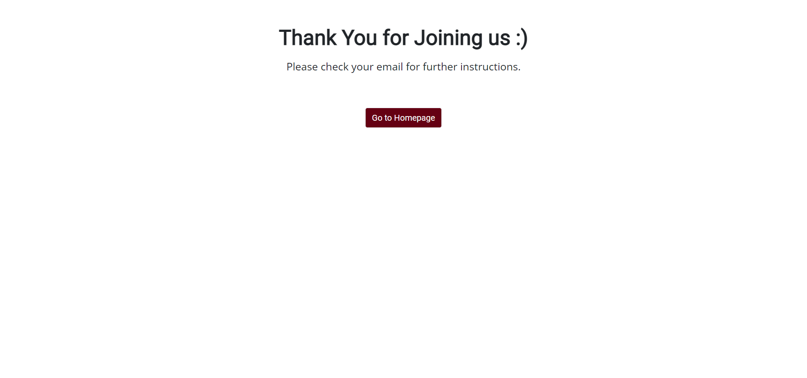

---

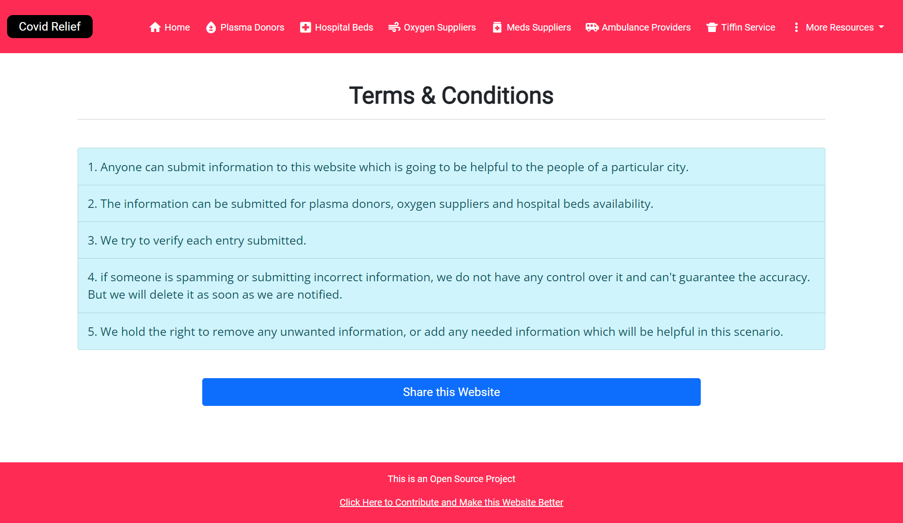

---

# Try the Project Here
[Live Demo Here](https://my-covid-relief-website.web.app/)

# Dev Post Project Link
[Devpost Project Here](https://devpost.com/software/covid-relief-p4gqw3)
